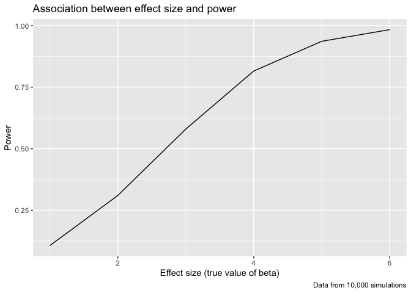
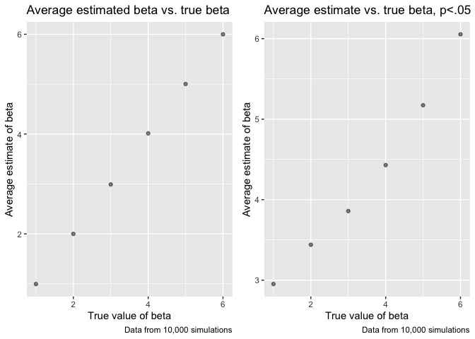

p8105\_hw5\_rac2224
================
Rachel Crowley
11/11/2019

## Problem 1

``` r
library(tidyverse)
```

    ## ── Attaching packages ─────────────────────────────────────────────────────────────────────────────── tidyverse 1.2.1.9000 ──

    ## ✔ ggplot2 3.2.1          ✔ purrr   0.3.2     
    ## ✔ tibble  2.1.3          ✔ dplyr   0.8.3     
    ## ✔ tidyr   1.0.0.9000     ✔ stringr 1.4.0     
    ## ✔ readr   1.3.1          ✔ forcats 0.4.0

    ## ── Conflicts ─────────────────────────────────────────────────────────────────────────────────────── tidyverse_conflicts() ──
    ## ✖ dplyr::filter() masks stats::filter()
    ## ✖ dplyr::lag()    masks stats::lag()

``` r
library(dplyr)

set.seed(10)

iris_with_missing = iris %>% 
  map_df(~replace(.x, sample(1:150, 20), NA)) %>%
  mutate(Species = as.character(Species))

mean_nonmiss = function(x) {
  x[is.na(x)] <- round(mean(x, na.rm = TRUE), 1)
  x
  x[is.character(x)] <- replace_na(x, "virginica")
}

output = map_df(.x = iris_with_missing, ~ mean_nonmiss(.x))
```

    ## Warning in mean.default(x, na.rm = TRUE): argument is not numeric or
    ## logical: returning NA

## Problem 2

Reading in the data for each subject and creating two new columns for ID
and Arm (control vs. experimental)

``` r
case_control = 
  list.files(path = "./data", full.names = TRUE)

read_obs = function(path) {
     test = read.csv(path)
     arm = str_split( path, pattern = "_", simplify = TRUE)
     type <- paste(c("con","exp"), collapse="|")
     test$control_arm = str_extract_all(arm[, ncol(arm) - 1], pattern = type )
     test$subject_id = str_extract(arm[, ncol(arm)], pattern = "\\d{1,2}")
     test
}

all_data = map_df(.x = case_control, ~read_obs(.x))
```

Further tidying the dataset

``` r
all_data = all_data %>%
  janitor::clean_names() %>%
  pivot_longer(
    week_1:week_8,
    names_to = "week", 
    names_prefix = "week_",
    values_to = "observation") 
```

Spaghetti plot showing observations on each subject over time

``` r
all_data <- as.data.frame(lapply(all_data, unlist)) 
all_data$subject_id <- ifelse(all_data$subject_id == 01, 11,all_data$subject_id)
all_data$subject_id[all_data$control_arm == 'exp'] = all_data$subject_id + 10
```

    ## Warning in all_data$subject_id[all_data$control_arm == "exp"] =
    ## all_data$subject_id + : number of items to replace is not a multiple of
    ## replacement length

``` r
group_diff = 
ggplot(data = all_data, aes(x = as.numeric(week), y = observation, group = subject_id, color =control_arm)) + geom_line() +
  labs(
      title = "Control vs. experimental observations over time",
      x = "Week",
      y = "Observation",
      caption = "Data from a longitudinal study"
    ) + 
   scale_color_hue(name = "Control Arm", labels = c("control", "experimental")) 

group_diff
```

<!-- -->

Differences between control arms

  - At the start of the study, baseline observations are scattered
    across values, with some subjects in the control arm having higher
    values than some subjects in the experimental arm, lower values than
    some subjects in the experimental arm, and similar values to that of
    the experimental arm. From weeks 2 to 6, subjects in the
    experimental arm have observations that increase more on average
    than those in the control arm. By the end of the study at week 8,
    all observations for the experimental arm subjects are higher in
    value than those of the control arm subjects. Experimental arm
    subjects have observations that increase in value by week 8 compared
    to baseline, while observations of the control subjects appear to
    remain the same or decrease in value.

## Problem 3

Running 10000 simulations for inputted beta1(s) to generate estimates
and p-values

``` r
set.seed(1)

n = 30
beta0 = 2
vari = 50

 
sim_regression = function(n, beta0, beta1, vari)  {
  e = rnorm(n, sd = sqrt(vari))
  x = rnorm(n, mean = 0, sd = 1)
  y = beta0 + beta1 * x + e
  
  ls_fit = lm( y~ x)
  broom::tidy(ls_fit)[2, c(2,5)]
  
}

sim_results = rerun(10000, sim_regression(n, beta0, 0, vari)) %>%
  bind_rows() 

truebeta = 
  tibble(beta_1 = 1:6) %>%
  mutate(
    output_lists = map(.x = beta_1, ~rerun(10000, sim_regression(n, beta0, beta1 = .x, vari))),
    estimate_df = map(output_lists, bind_rows)
  ) %>%
  select(-output_lists) %>%
  unnest(estimate_df) 
```

Plot comparing effect size (true beta1) to power

``` r
truebeta  %>%
    group_by(beta_1) %>%
    summarize(power = sum(p.value<.05)/n()) %>%
    ggplot(aes(x = beta_1, y = power)) + geom_line() +
      labs(
        title = "Association between effect size and power",
        x = "Effect size (true value of beta)",
        y = "Power",
        caption = "Data from 10,000 simulations"
      )
```

<!-- -->

  - As effect size or the true value of beta increases from 1 to 6, the
    power of the test increases. As effect size increases, we have an
    increased probability of correctly rejecting the null hypothesis
    when there is a difference between estimated and true beta at 5%
    level of significance.

Plot showing the average estimate of β̂1 on the y axis and the true
value of β1 on the x axis

``` r
library(patchwork)

plot2 = 
  truebeta %>%
    group_by(beta_1) %>%
    summarize(estimate_mean = mean(estimate)) %>%
    ggplot(aes(x = beta_1, y = estimate_mean)) + geom_point(alpha = .5) +
      labs(
        title = "Average estimated beta vs. true beta",
        x = "True value of beta",
        y = "Average estimate of beta",
        caption = "Data from 10,000 simulations"
      )

plot3 = 
  truebeta %>% 
    filter(p.value < .05) %>%
    group_by(beta_1) %>%
    summarize(estimate_mean = mean(estimate)) %>%
    ggplot(aes(x = beta_1, y = estimate_mean))  + geom_point(alpha = .5) +  
      labs(
        title = "Average estimate vs. true beta, p<.05",
        x = "True value of beta",
        y = "Average estimate of beta",
        caption = "Data from 10,000 simulations"
      )

combined = 
(plot2 + plot3)
    
combined
```

<!-- -->

  - When comparing the sample average of beta1 to the true value of beta
    regardless of the p-value, the average estimate and true values are
    very similar. For example, when true beta is 1, the average estimate
    is .99; when true beta is 6, the average estimate is 6.00. Since all
    tests are included, such as tests with p \>.05 where the estimate
    and true beta are similar, the average estimate of beta will be
    approximately equal to the true value of beta.

  - In contrast, the sample average of beta1 across tests for which the
    null is rejected is not approximately equal to the true value of
    beta1. As true beta1 or the effect size increases, we have increased
    power and the sample average of beta1 becomes closer to the true
    beta1. Since we are restricted to tests for which the null is
    rejected (p \<.05), this means we are only including tests where the
    estimated betas differ significantly from the true value of beta in
    our average estimate; thus, the average estimated betas are greater
    than the true betas. For example, when true beta is 1, the average
    estimate is 2.95; when true beta is 3, the average estimate is 3.86;
    and when true beta is 6, the average estimate is 6.05.
