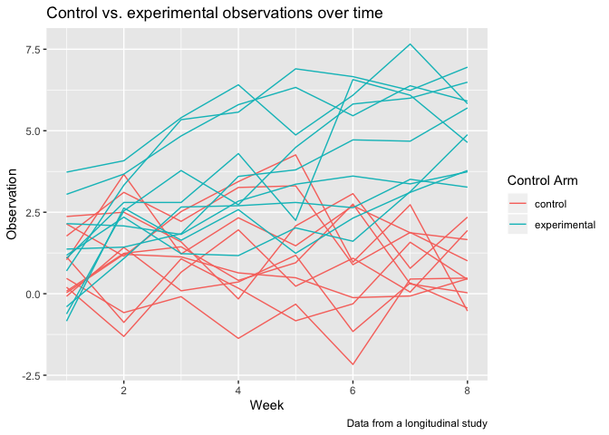

p8105\_hw5\_rac2224
================
Rachel Crowley
11/11/2019

## Problem 1

``` r
library(tidyverse)
```

    ## ── Attaching packages ─────────────────────────────────────────────────────────────────────────────── tidyverse 1.2.1.9000 ──

    ## ✔ ggplot2 3.2.1          ✔ purrr   0.3.2     
    ## ✔ tibble  2.1.3          ✔ dplyr   0.8.3     
    ## ✔ tidyr   1.0.0.9000     ✔ stringr 1.4.0     
    ## ✔ readr   1.3.1          ✔ forcats 0.4.0

    ## ── Conflicts ─────────────────────────────────────────────────────────────────────────────────────── tidyverse_conflicts() ──
    ## ✖ dplyr::filter() masks stats::filter()
    ## ✖ dplyr::lag()    masks stats::lag()

``` r
set.seed(10)

iris_with_missing = iris %>% 
  map_df(~replace(.x, sample(1:150, 20), NA)) %>%
  mutate(Species = as.character(Species))

mean_nonmiss = function(x) {
  x[is.na(x)] <- round(mean(x, na.rm = TRUE), 1)
  x
  x[is.character(x)] <- replace_na(x, "virginica")
}

output = map_df(.x = iris_with_missing, ~ mean_nonmiss(.x))
```

    ## Warning in mean.default(x, na.rm = TRUE): argument is not numeric or
    ## logical: returning NA

## Problem 2

Reading in the data for each subject and creating two new columns for ID
and Arm (control vs. experimental)

``` r
case_control = 
  list.files(path = "./data", full.names = TRUE)

read_obs = function(path) {
     test = read.csv(path)
     arm = str_split( path, pattern = "_", simplify = TRUE)
     type <- paste(c("con","exp"), collapse="|")
     test$control_arm = str_extract_all(arm[, ncol(arm) - 1], pattern = type )
     test$subject_id = str_extract(arm[, ncol(arm)], pattern = "\\d{1,2}")
     test
}

all_data = map_df(.x = case_control, ~read_obs(.x))
```

Further tidying the dataset

``` r
all_data = all_data %>%
  janitor::clean_names() %>%
  pivot_longer(
    week_1:week_8,
    names_to = "week", 
    names_prefix = "week_",
    values_to = "observation") 
```

Spaghetti plot showing observations on each subject over time

``` r
all_data <- as.data.frame(lapply(all_data, unlist)) 
all_data$subject_id <- ifelse(all_data$subject_id == 01, 11,all_data$subject_id)
all_data$subject_id[all_data$control_arm == 'exp'] = all_data$subject_id + 10
```

    ## Warning in all_data$subject_id[all_data$control_arm == "exp"] =
    ## all_data$subject_id + : number of items to replace is not a multiple of
    ## replacement length

``` r
group_diff = 
ggplot(data = all_data, aes(x = as.numeric(week), y = observation, group = subject_id, color =control_arm)) + geom_line() +
  labs(
      title = "Control vs. experimental observations over time",
      x = "Week",
      y = "Observation",
      caption = "Data from a longitudinal study"
    ) + 
   scale_color_hue(name = "Control Arm", labels = c("control", "experimental")) 

group_diff
```

<!-- -->

Differences between control arms \* At the start of the study, baseline
observations are scattered across values, with some individuals in the
control arm having higher values than some subjects in the experimental
arm, lower values than some subjects in the experimental arm, and
similar values to that of the experimental arm. From weeks 2 to 6,
subjects in the experimental arm have observations that increase more on
average than those in the control arm. By tht end of thes study at week
8, all observations for the experimental arm subjects are higher in
value than those of the control arm subjects. The majority of
experimental arm subjects have observations that increase in value over
time, while observations of the control subjects appear to remain the
same or decrease in value.

## Problem 3
